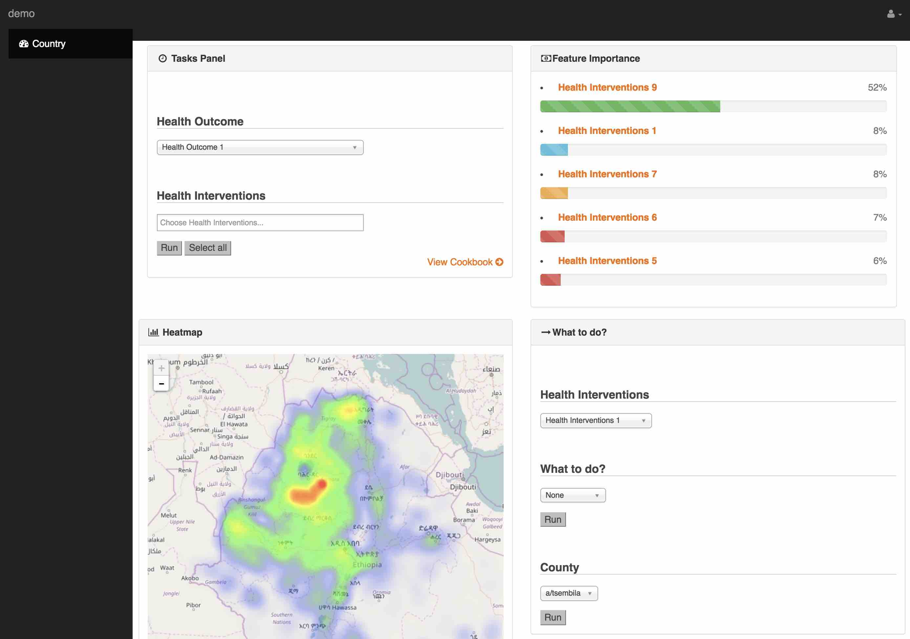

# data analytic web app to predict certain health outcomes using public health data and geospatial data 

#### introduction
* a web application using Flask, SQL, Javascript and AWS
* machine learning methods (e.g.random forest,SVM) behind

#### run it
1. run ./run.py
2. open http://0.0.0.0:5000/

#### screenshot
* demo

